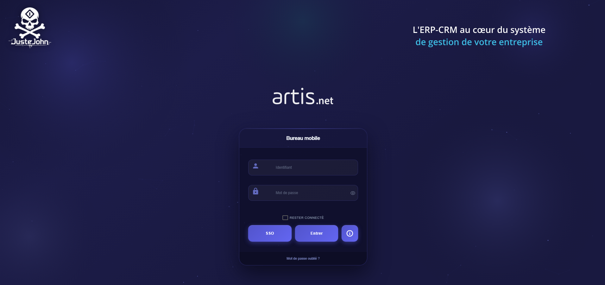
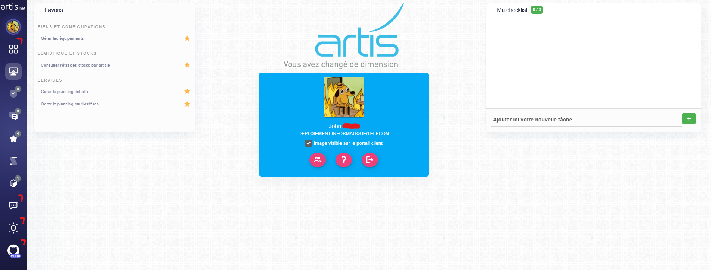
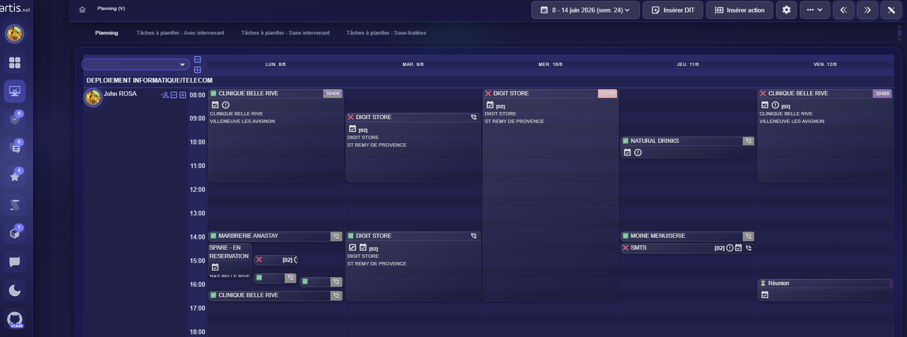
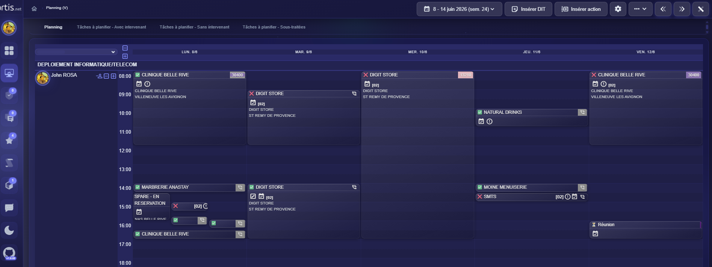
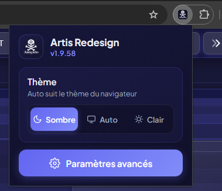
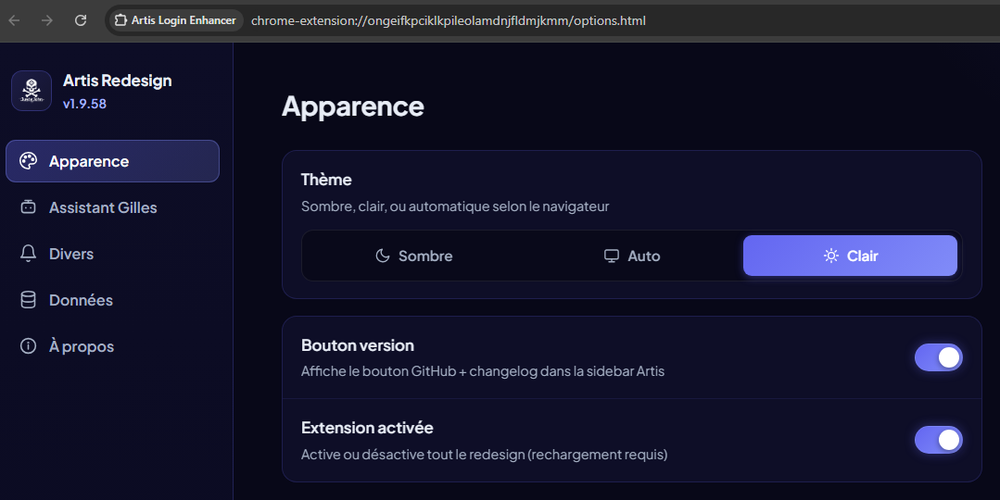

<div align="center">

# 🎨 Artis Redesign

### Extension Chrome / Edge — Thème dark glassmorphism + assistant IA pour Artis.net

Transforme l'ERP **Artis.net** en une interface moderne, sombre et fluide,
avec **Gilles**, un assistant IA intégré (Gemini) qui connaît la doc Artis
et le contenu des pages visitées.


</div>

---

## ✨ Fonctionnalités

### Thème
| | |
|---|---|
| 🌑 **Dark glassmorphism** | Thème sombre complet, surfaces translucides, bordures indigo |
| ☀️ **Clair/sombre/auto** | Toggle lune/soleil dans la sidebar, persistant (défaut : clair) |
| 🧭 **Menu popup flottant** | Le menu de navigation s'ouvre en panneau flottant depuis un bouton sidebar — sous-menus en popup au survol, zéro décalage de layout |
| ⚙️ **Page paramètres** | Page d'options complète (thème, Gilles, notifications, export/import JSON), accessible (16px, navigation clavier) |
| 💜 **Bleu Artis → violet** | Remplacement du bleu d'origine (`#00AEEF`) par l'indigo `#6366f1` |
| 🎯 **Zéro blanc résiduel** | Strip runtime (MutationObserver batché) + CSS « nuclear » |
| 🖼️ **Login retravaillé** | Canvas animé (30 fps, en pause onglet caché), toggle mot de passe |
| 📅 **Planning** | Grille dark, blocs harmonisés, état ✅/❌/⏳ dans le titre des blocs |
| ⏳ **Chargement** | Loader custom double anneau, overlay dark |

### Gilles — assistant IA
| | |
|---|---|
| 💬 **Chat intégré** | Pop-up depuis la sidebar (avatar robot), Markdown, historique local, mémoire réglable 5–30 messages |
| 📚 **Base de connaissance** | Doc Artis bundlée, récupération ciblée par question |
| 🧩 **Préprompts en .md** | `GILLES.example.md` / `GILLES_REFORM.example.md` génériques fournis — copiez-les en `GILLES.md` / `GILLES_REFORM.md` (gitignorés) pour vos règles internes, ils priment automatiquement |
| 📄 **Mémoire des pages** | Se souvient des pages visitées dans la session (désactivable) |
| ✍️ **Bouton Reformuler** | Dans la toolbar du compte rendu d'intervention : transforme les notes brutes en CR structuré, en lisant le contexte de la DIT (client, site, demande) |
| 🔔 **Notifications** | Nouvelles DIT + réponses de Gilles quand l'onglet n'est pas affiché (opt-in) |
| 🔒 **Confidentialité** | Tokens de session jamais envoyés ; partage des pages désactivable ; données stockées uniquement en local |

---

## 📸 Aperçu

| Login | Accueil |
|---|---|
|  |  |

| Planning — sombre | Planning — clair |
|---|---|
|  |  |

| Popup | Paramètres avancés |
|---|---|
|  |  |

---

## 📦 Installation

1. Cloner le dépôt
   ```bash
   git clone https://github.com/SimplementJohn/Artis-Redesign.git
   ```
2. Ouvrir `chrome://extensions` (ou `edge://extensions`)
3. Activer le **Mode développeur**
4. **Charger l'extension non empaquetée** → sélectionner le dossier `extension/`
5. Ouvrir Artis.net — le thème s'applique automatiquement
6. **Pour Gilles** : icône de l'extension → **Paramètres avancés** → coller une clé API
   [Google AI Studio](https://aistudio.google.com/apikey) → Enregistrer
7. *(Optionnel)* Copier `extension/GILLES.example.md` → `extension/GILLES.md` et
   `extension/GILLES_REFORM.example.md` → `extension/GILLES_REFORM.md` pour
   personnaliser les préprompts (fichiers gitignorés, jamais poussés)

La popup de l'extension = thème (sombre/auto/clair) + bouton **Paramètres avancés**
(page complète : Gilles, partage des pages, notifications, mémoire, export/import).

---

## 🗂️ Structure

```
extension/
├── manifest.json          # MV3 — permissions minimales (storage, notifications)
├── content.js             # Login : canvas + animations + password toggle
├── login-override.css     # Login : glassmorphism dark
├── app-content.js         # App : thème runtime, observer, toggle, Reformuler, suivi DIT
├── app-override.css       # App : thème complet
├── giles.js / giles.css   # Gilles : UI chat (pop-up, conversations)
├── giles-bg.js            # Service worker : appels Gemini, base de connaissance
├── GILLES.example.md      # Préprompt système générique (copier en GILLES.md pour personnaliser)
├── GILLES_REFORM.example.md # Préprompt Reformuler générique (idem → GILLES_REFORM.md)
├── knowledge/ + artis.txt # Doc Artis bundlée (sync via sync-knowledge.ps1)
├── fonts/                 # Polices locales (aucune requête externe)
├── popup.html/.css/.js    # Popup : thème + accès paramètres avancés
└── options.html/.css/.js  # Page paramètres complète (onglet Chrome)

CLAUDE.md     # Doc technique agent (sélecteurs, lexique, pièges, règles)
AUDIT.md      # Audit perf/sécu + plan d'optimisation + règles code futur
ERROR.md      # Journal des erreurs à ne plus refaire
```

---

## 🎨 Design system

| Token | Valeur | Usage |
|-------|--------|-------|
| `--a-bg` | `#181836` | Fond page |
| `--a-s1` | `#1e1e44` | Surfaces cards |
| `--a-p` | `#6366f1` | Indigo primaire |
| `--a-p2` | `#818cf8` | Indigo clair (hover/actif) |
| `--a-text` | `#e2e8f0` | Texte principal |
| `--a-green` | `#10b981` | Vert success |

**Typo** : Plus Jakarta Sans (app) · Space Grotesk + DM Sans (login) — bundlées localement.

---

## 🌐 Pages ciblées

```
Login : https://artis.digithall.org/*/composants/login/*
App   : https://artis.digithall.org/ArtisWebDigitInvest/*
```

## 🛠️ Stack

Cible : HTML Bootstrap 5 · jQuery (Metronic) · TinyMCE 6 — pas de framework moderne.
Extension : vanilla JS + CSS pur, zéro dépendance, zéro build.

---

## 🙏 Remerciements

Merci à [@Brotaaa](https://github.com/Brotaaa) pour la contribution de la page de paramètres avancés (options page sur onglet Chrome) — [PR #2](https://github.com/SimplementJohn/Artis-Redesign/pull/2) 💜

---

<div align="center">

Fait avec 💜 par **[JusteJohn](https://github.com/SimplementJohn)**

</div>
